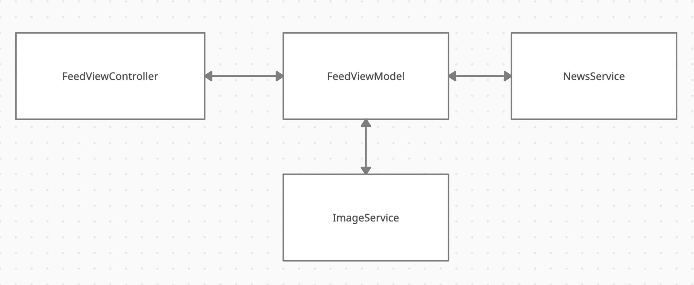

# News Reader

## Requirement

Develop an news app, which call Restful API.

## Some important notes
- Not blocking user interaction when calling API requests.
- Caching images after loading from URL to reuse later.
- User scroll on collection view fast. Possibly the imaged loaded from previous view model, display on the cell which does not have the same view model, and causes incorrect data display on that cell.

## Solution
### Run non-UI specific tasks in background thread
`QueueManager` is the class used to managed operations, which run on background threads. In this class, its property `OperationQueue` will manage to run the operations in multiple threads. We can also configure `QueueManager` to run how many concurrent tasks.

Apart from `QueueManager`, we have `BaseOperation` class. This is the base class to define how an operation is executed, and when it is finished based on the `State`. Normally, a basic operation will finish when function `main` is finished. However, using this approach, when a URL operation executes, the `main` function will finish before the URL request returns response. Therefore, we need to define our own `State` to manually define the case when operation finish executing.

Therefore, when we subclass `BaseOperation` and override the function `main`, we need to call `copmlete` function, to tell the `QueueManager` that this operation is finished, so the `QueueManager` can execute other operations.

To run other tasks after the operations finish (like updating the UI, or view model), `BaseOperation` has `completionHandler` return the `Result` of that operation.

### Caching images
When fetching images from URL, we use `CacheImageOperation`. The instance of this class will fetch images from URL and store these images into physical files system (Caches/Download folder)

The operation caches images based on the hashed name of the image, and save image with that name in the file system. Using this approach, when user restart the application and make the URL request. If the names of the images are the same with previous session, it will load the cached images instead of making other URL calls.

### Cancel caching image operation
When user scroll the collection view super fast, the app will create multiple `CacheImageOperation` to download images for cells. Because the cells are reused, so the reused cell still keeps the previous reference viewModel of downloading image. This will cause the issue that the cell will display incorrect image of other viewModel.

To fix this issue, in the `prepareForReuse` function of `ContentCell`, we need to clear the reference between the current cell and previous viewModel.

Also, the caching image operation of the previous viewModel is not needed, because user have scrolled through that cell. Therefore, we need to `stopRequestDataForCell` in viewModel, so we can cancel caching image operation for cells which are no longer showed on screen.

## Architecture:

The architecture of the application is MVVM. UI is built by code using auto layout. I also follow SOLID principles.

There are 2 scheme to run the app. `SimpleNews` scheme is to run with real API, `SimpleNews (Mock)` scheme is to run against local mock json files (which is easier to test in the scenario does not have internet connection, or API is not ready)

## Third parties dependency:

The application does not include third parties library. It can be run immediately using XCode 10

## Testing

### Unit testing
I wrote unit tests to cover the logic of service, viewModel, etc.

Test coverage: over 80%

### UI testing:
UI testing cover the scenario of loading the data in `FeedViewController`, and navigation from first view to `WebViewController`.

## Coding style

I follow Ray Wenderlich coding style (https://github.com/raywenderlich/swift-style-guide), also use SwiftLint to auto correct my code

## Additional features
- Animation
- Testing against mock service
